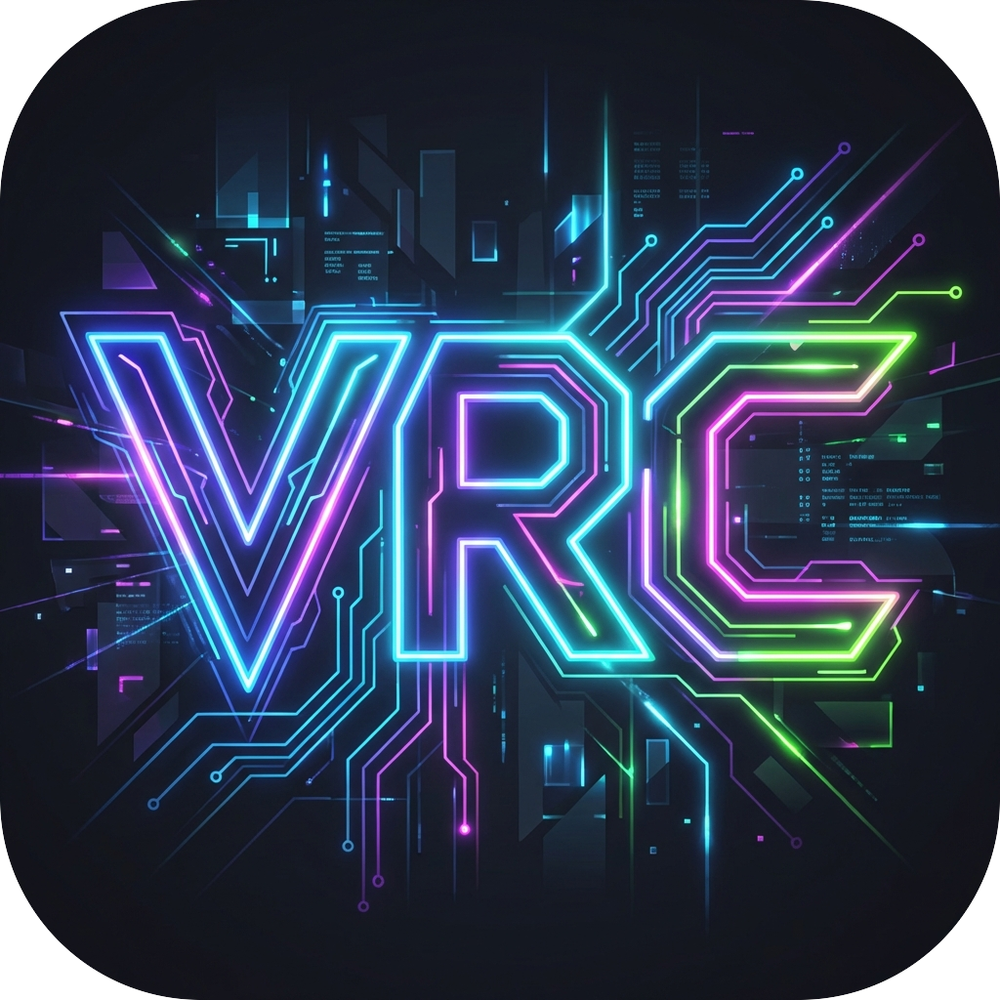

<div align="center">
  

  # 🚀 VRC OSC App

  
  
  

  ✨ 在手机上利用OSC协议，在VRChat游戏内与模型进行各种交互

</div>

---

## 🌟 当前实现的功能

- ✅ 手机上操控模型的轮盘上的各种预设(目前仅支持boolean类型操作和百分比操作项,其它类型会置灰不可操作)
- ✅ 手机上语音翻译并显示在chatbox上
- ✅ 持久化存储avatar数据
- ✅ 支持avatar的json字符串导入
- ✅ 本地IP和端口的修改
- ......more are coming soon

## 📸 应用截图

<div align="center">
  
  
  
  
</div>

## 📦 安装与使用

```sh
# 克隆项目
git clone https://github.com/laststranger/vrc_osc_app.git
cd vrc_osc_app

# 安装依赖
npm install

# 运行项目
npx expo prebuild --clean
npm run start
npx expo run:ios // 电脑模拟器
npx expo run:android // 电脑模拟器
```

## ⚠️ 注意事项

- **模型数据**: 模型的json文件目录在 `C:\Users\XXX\AppData\LocalLow\VRChat\VRChat\OSC\usr_XXXXXXXX\Avatars` 目录下，将项目中的data.json文件内容替换操控的模型数据

- **翻译功能**: 需要使用腾讯云的 API Key，创建一个 `.env` 文件，填入以下内容：
  ```env
  EXPO_PUBLIC_TENCENT_SECRET_ID="XXXXX"
  EXPO_PUBLIC_TENCENT_SECRET_KEY="XXXX"
  ```

- **打包说明**: 目前该项目需要自己打包本地使用，生产包等我有时间再弄吧


## 🤝 贡献指南

欢迎任何形式的贡献！你可以：
- 📝 提交 Issue 反馈问题
- 🔧 Fork 项目并提交 Pull Request
- 💡 提出新的功能建议

## 📜 许可证

本项目遵循 **MIT 许可证**。

---

<div align="center">

🚀 **喜欢这个项目的话，欢迎 Star ⭐，让更多人看到它！**

</div>
